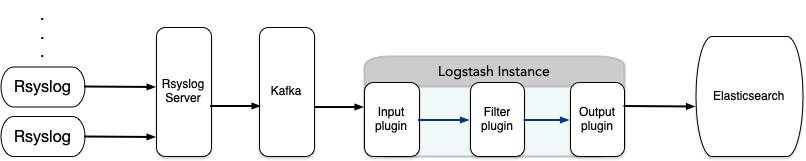

# 日志管理平台 ELK

## 前言
本项目配合 elk 技术栈进行日志管理，关联项目地址为 https://github.com/evling2020/syslog-elk.git ，整体架构如下：


 
## 条件
- 服务器需安装 docker & docker-compose 即可

## 特色

- rsyslog 服务端不留存日志，直接转储 kafka ，当然你可根据需要是否留存 rsyslog 服务端本地
- 默认留存 3 天的日志供 logstash 消费

## 快速开始
```bash
git clone https://github.com/evling2020/rsyslog-kafka.git
docker-compose up -d
```

## 日志对接

在待采集日志的终端上配置 rsyslog ，主流平台默认已内置该软件，直接配置即可，一般是在 /etc/rsyslog.conf 上追加如下内容：

```bash
*.*     @logger.evling.tech:514;RSYSLOG_SyslogProtocol23Format
```

并重启服务
```bash
systemctl restart rsyslog
```

## 更新日志
- **2023.05.27:** 首次创建项目

## 易雾山庄

该项目是易雾山庄-家庭基建的一部分，[**易雾山庄**](https://www.evling.tech)记录了家庭网络基础建设的种种实践，可以帮助更多有需要的人减少折腾。希望通过这个平台构建一只家庭基建小社群，共同优化我们的生活体验，增强个人数据安全保护意识，同时我们还要考虑环保节能问题，实实在在帮大家伙组建属于自己的家庭网络。欢迎关注微信公号《易雾山庄》，订阅易雾君的独家折腾！！！

